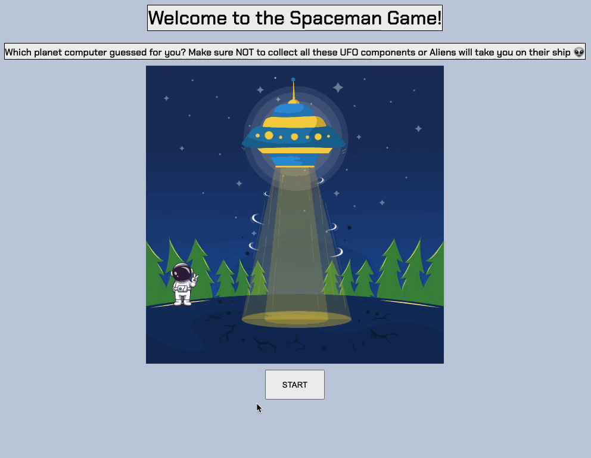

# Spaceman-game
Is a word guessing game. Computer thinks of a word, the player guesses it by choosing letters from the alphabet. There are certain amount of guesses - to draw a spaceship. After player guesses the word, they win. If player used all guesses and still not guessed the word, they lose.

## Game action

After user opens the game, it shows up empty board with clickable "Start" button on the center of the page. After user clicked on the Start button, game starts.

## Screenshots
*Start page*


*Gameplay*


## Technologies Used
 

 The code is written on VanillaJS meaning that it is plain HTML/CSS/JavaScript. MVC-based architecture.

## Getting Started
Which planet computer guessed for you? Make sure NOT to collect all the UFO components or Aliens will take you on their ship 👽
<a href="[https://mariiatkachenko.github.io/Spaceman-game" target="_blank">Demo Link</a>

## Some code parts
- Challenging function
```JS
function renderGuessedWord() {
  guessedWord.forEach((letter, idx) => {
    //check if span with id not exists then create span
    if (!getWordLetterEl(idx)) {
      createChildForParent('span', makeWordLeterElId(idx), currentWordEl);
    }

    if (usedLetters.includes(letter)) {
      getWordLetterEl(idx).innerText = letter;
    } else {
      getWordLetterEl(idx).innerText = '_';
    }
  });

  if (currentWordEl.innerText === currentWord) {
    
    return showMessage('win');
  }
}
```

- Favorite function
```JS
function makeMove(evt) {
  if (evt.target.tagName !== 'BUTTON') return;
  const letter = evt.target.innerText
  usedLetters.push(letter.toLowerCase());
  // if user clicked the letter that is not included in word, add +1 to the wrongLetter
  if(!guessedWord.includes(letter.toLowerCase())) {
    if (wrongLetter >= Object.keys(spaceship).length) {
      setVisibility(spacemanEl, 'none');
      return showMessage('loss');
    }
    wrongLetter += 1;
  }

  // handle wrong letters
  for (let i = 0; i < wrongLetter;  i++) {
    const objName = Object.keys(spaceship)[i]
    spaceship[objName] = true;
  }

  render();
}
```

## Unique elements
In this project I added some nice graphic elements from Freepik. Freepic is an online resource with a lot of free to use graphics. I added credit links to the bottom of the game page.

## Future improvements

| Type | Description |
| :--------- | :-------: |
| Add sound| 1. Add space themed music playing in the background. <br>2. Add sound for win/loss.|
| Animation | When spaceship took Spaceman, add spaceship fly away animation.|
| Responsiveness |Add more advanced mobile support.|
